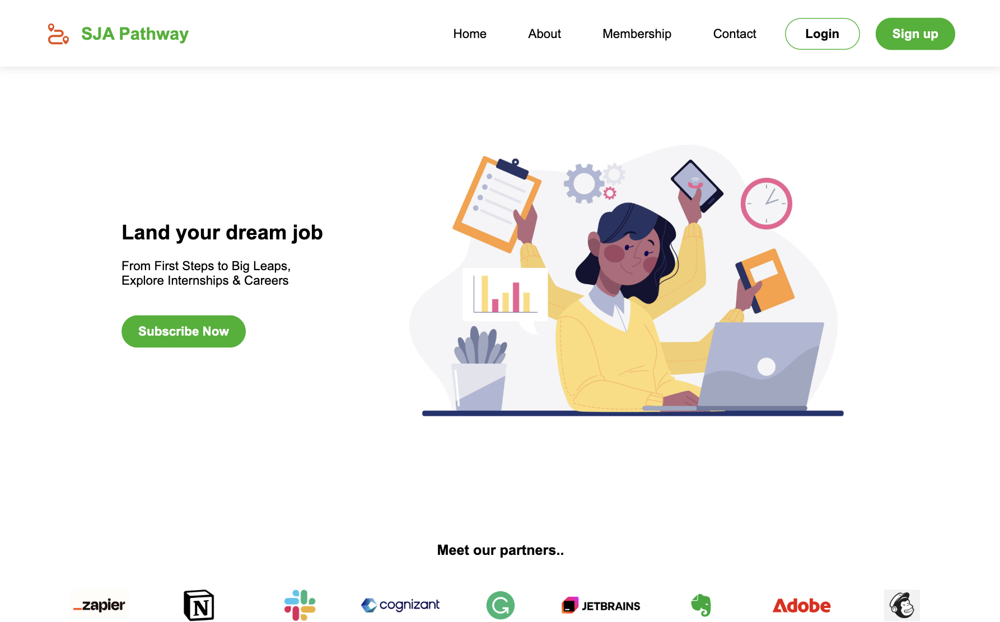

<a name="readme-top"></a>

### Demo :

[Watch Preview](https://drive.google.com/file/d/12jAqVLQvObPCjowWtPs3u2TWyWbXkFur/view?usp=sharing)
<!-- TABLE OF CONTENTS -->

# 📗 Table of Contents

- [📖 About the Project](#about-project)
  - [🛠 Built With](#built-with)
    - [Tech Stack](#tech-stack)
    - [Key Features](#key-features)
- [💻 Getting Started](#getting-started)
  - [Prerequisites](#prerequisites)
  - [Installation](#installation)
- [Author](#author)
- [Socials](#socials)

<!-- PROJECT DESCRIPTION -->

# SJA Pathway <a name="about-project"></a>

**SJA Pathway!** SJA Pathway is a career and internship platform designed to empower students and professionals in achieving their career goals. The website connects users with valuable internship and job opportunities, offers expert career guidance, and fosters a supportive community. Through partnerships with leading organizations, SJA Pathway provides access to real-world experiences, professional networking, and tailored resources to help users build successful careers. Join SJA Pathway to take the next step toward your dream job and unlock a world of opportunities.

## 🛠 Built With <a name="built-with"></a>

### Tech Stack <a name="tech-stack"></a>


<details>
  <summary>Client</summary>
  <ul>
    <li>HTML</li>
  </ul>
</details>

<details>
  <summary>Server</summary>
  <ul>
    <li>CSS</li>
  </ul>
</details>

<details>
<summary>Package Manager</summary>
  <ul>
    <li>Node.js</li>
  </ul>
</details>

plugins:
- **Font Awesome & Boxicons** – Iconography

<!-- Features -->

### Key Features <a name="key-features"></a>


- Responsive design for all devices
- Hero section with a clear call-to-action
- Partner companies showcase
- Feature highlights for career and internship seekers
- User testimonials
- Newsletter subscription form
- Modern footer with social links and navigation

## 📸 Screenshots

| Desktop View | Mobile View |
|--------------|-------------|
|  |  |


<!-- GETTING STARTED -->

## 💻 Getting Started <a name="getting-started"></a>

To get a local copy up and running, follow these steps.

### Prerequisites

In order to run this project you need:

- Git
- Node.js
- Linters

### Installation

1. **Clone the repository:**
    ```bash
    git clone https://github.com/musaibxandra/Hello-world.git
    cd Hello-world
    ```

2. **(Optional) Install linters:**
    ```bash
    npm install
    npm run test
    ```

3. **Open `index.html` in your browser to view the site.**

---

#### Node.js:

- For MacOS:
    ```sh
    brew install Node
    ```

- For Windows:
    ```bash
    curl -fsSL https://deb.nodesource.com/setup_20.x | sudo -E bash -
    sudo apt-get install -y nodejs
    ```

- For Linux:
    ```bash
    curl -fsSL https://deb.nodesource.com/setup_20.x | sudo -E bash -
    sudo apt-get install -y nodejs
    ```

### Installation

1. Clone the repository
```bash
git clone https://github.com/musaibxandra/Hello-world.git
cd Hello-world
```

2. Set up package.json
```bash
npm init -y
```

<!-- AUTHORS -->

## Author

- Mohammed Maqdoom - [GitHub](https://github.com/musaibxandra)

## Socials

- [LinkedIn](https://linkedin.com/in/musaibxandra)

